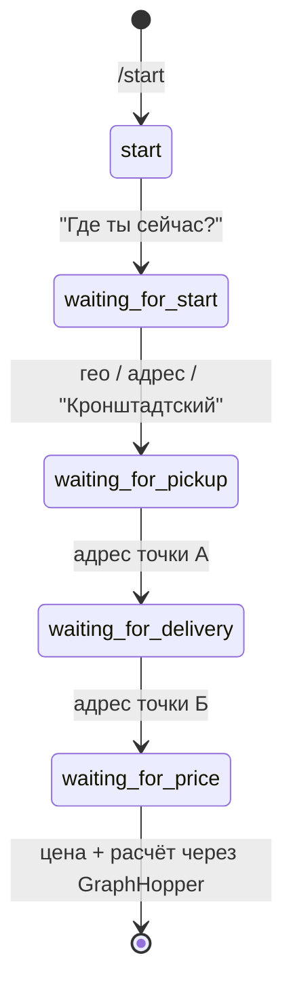

# Dostavista Geo Telegram Bot

[](https://t.me/DostavistaGeoBot)
[](https://python.org)
[](https://github.com/aiogram/aiogram)
[](https://graphhopper.com/)
[](https://docker.com)
[](LICENSE)

Telegram-бот для курьеров Достависта (и не только), помогающий оценить выгодность заказа перед принятием.
Бот считает чистую прибыль и часовую ставку с учётом расстояния, времени в пути и затрат на топливо.

> 🤖 **Живой бот:** [@DostavistaGeoBot](https://t.me/DostavistaGeoBot) — можно протестировать расчёт.

---

## Что умеет

Принимает от пользователя:
- текущее местоположение (текст или геопозиция)
- адрес забора груза (точка А)
- адрес доставки (точка Б)
- предложенную цену заказа

Возвращает:
- суммарное расстояние и время маршрута
- стоимость топлива
- чистую прибыль
- часовую ставку
- вердикт о целесообразности заказа

### Шкала оценки

| Ставка | Вердикт |
|---|---|
| < 500 ₽/ч | 🔴 **НЕ БЕРЕМ** |
| 500–700 ₽/ч | 🟠 **БЕРЁМ, НО ДУМАЕМ** |
| 700–1000 ₽/ч | 🟢 **БЕРЁМ! ОТЛИЧНО** |
| > 1000 ₽/ч | 🟡 **НЕВИДАННАЯ ЩЕДРОСТЬ!** |

---

## Стек

- **Python 3.11+** + **aiogram 3.x** — асинхронный фреймворк для Telegram Bot API
- **GraphHopper API** — геокодинг и расчёт маршрутов (автомобиль)
- **aiohttp** — асинхронные HTTP-запросы к внешним API
- **aiohttp-retry** — экспоненциальный ретрай с джиттером для устойчивости к flaky API
- **aiolimiter** — токен-бакет rate limiter (RPS) для соблюдения лимитов GraphHopper
- **Redis** — персистентное хранилище FSM-состояний (выживает при рестарте, работает в кластере)
- **python-dotenv** — конфигурация через `.env`
- **Docker / Docker Compose** — запуск в контейнере одной командой
- **FSM (Finite State Machine)** — сценарий пошагового ввода данных
- **Circuit Breaker** — защита от каскадных сбоев внешних API

---

## Структура проекта

```
Dostavista/
├── bot.py                 # Основная логика бота, FSM, хендлеры, GraphHopper API
├── config.py              # Загрузка конфигурации из .env с валидацией
├── circuit_breaker.py     # Async Circuit Breaker для внешних API
├── logging_config.py      # Настройка логирования (консоль + файл с ротацией)
├── requirements.txt       # Зависимости Python
├── .env.example           # Шаблон переменных окружения
├── .gitignore             # Что не коммитим в git
├── .dockerignore          # Что не попадает в Docker-образ
├── Dockerfile             # Инструкция сборки образа
├── docker-compose.yml     # Запуск в контейнере одной командой
├── README.md              # Этот файл
├── LICENSE                # MIT License
└── tests/                 # Юнит- и интеграционные тесты
    ├── conftest.py        # Фикстуры pytest
    ├── test_utils.py      # Утилиты: парсинг координат, расчёты
    ├── test_circuit_breaker.py # Circuit Breaker тесты
    ├── test_http.py       # HTTP клиент тесты
    ├── test_fsm.py        # FSM и хендлеры тесты
    └── test_logging.py    # Логирование тесты
```

---

## Быстрый старт

### Через Docker (рекомендуется)

```bash
# 1. Клонировать репозиторий
git clone https://github.com/jkorovay/dostavista_geo_tg_bot.git
cd dostavista_geo_tg_bot

# 2. Подготовить .env
cp .env.example .env
# Откройте .env и заполните BOT_TOKEN и GRAPHHOPPER_API_KEY

# 3. Запуск
docker compose up -d --build
docker compose logs -f
```

### Локально без Docker

```bash
# 1. Клонировать и перейти в папку
git clone https://github.com/jkorovay/dostavista_geo_tg_bot.git
cd dostavista_geo_tg_bot

# 2. Виртуальное окружение
python -m venv .venv
source .venv/bin/activate          # Windows: .venv\Scripts\activate

# 3. Зависимости
pip install -r requirements.txt

# 4. Переменные окружения
cp .env.example .env
# Заполните BOT_TOKEN и GRAPHHOPPER_API_KEY в .env

# 5. Запуск Redis (нужен для FSM storage)
docker run -d -p 6379:6379 redis:7-alpine

# 6. Запуск бота
python bot.py
```

Бот работает в режиме **long polling** — сам опрашивает Telegram на наличие новых сообщений; вебхуки не используются.

---

## Переменные окружения (`.env`)

| Переменная | Обязательна | Описание | По умолчанию |
|---|---|---|---|
| `BOT_TOKEN` | ✅ | Токен бота от [@BotFather](https://t.me/BotFather) | — |
| `GRAPHHOPPER_API_KEY` | ✅ | API-ключ GraphHopper (registration → Dashboard → Keys) | — |
| `FUEL_CONSUMPTION` | ❌ | Расход топлива, л/100 км | `9.5` |
| `FUEL_PRICE` | ❌ | Цена топлива, ₽/л | `70.0` |
| `MIN_HOURLY_RATE` | ❌ | Минимальная приемлемая ставка, ₽/ч | `500.0` |
| `WAIT_TIME_MINUTES` | ❌ | Время ожидания на точке, мин | `15` |
| `DEFAULT_START_ADDR` | ❌ | Координаты по умолчанию для кнопки «Я на Кронштадтском» (формат: lat,lon) | `55.8516018,37.5130927` |
| `HTTP_RETRY_ATTEMPTS` | ❌ | Количество попыток ретрая | `3` |
| `HTTP_RETRY_BASE_DELAY` | ❌ | Базовая задержка ретрая, сек | `0.5` |
| `GRAPHHOPPER_RPS` | ❌ | Rate limit (запросов в сек) для GraphHopper | `2` |
| `REDIS_URL` | ❌ | URL Redis для FSM storage | `redis://localhost:6379/0` |
| `LOG_LEVEL` | ❌ | Уровень логирования (DEBUG/INFO/WARNING/ERROR) | `INFO` |
| `LOG_FILE` | ❌ | Путь к файлу логов | `logs/bot.log` |
| `LOG_MAX_BYTES` | ❌ | Макс. размер файла лога до ротации, байт | `5000000` |
| `LOG_BACKUP_COUNT` | ❌ | Количество бэкапов логов | `3` |

Ключи **GraphHopper** и **BotFather** занимают ~1 минуту получения. Без них бот не запустится — `config.py` бросит понятную ошибку.

---

## Как пользоваться ботом

1. Нажмите **/start** (или «Запустить» в меню бота).
2. Бот спросит: **«Где ты сейчас?»** — пришлите геопозицию (📍), адрес текстом или нажмите **«📍 Я на Кронштадтском»**.
3. Введите **адрес точки А** (забор груза).
4. Введите **адрес точки Б** (доставка).
5. Введите **цену заказа** в рублях.
6. Подождите 1–2 секунды — бот вернёт расчёт с вердиктом.
7. Для нового расчёта — снова **/start**.

Команды:
- `/start` — начать новый расчёт (очищает состояние)

---

## Как это работает (под капотом)

### FSM-сценарий (машина состояний)



На каждом шаге бот ждёт конкретного ввода и переводит в следующее состояние. Состояние хранится в **Redis** (`RedisStorage`) — при рестарте бота незавершённый сценарий **выживает**, поддерживается горизонтальное масштабирование.

### Расчёт маршрута

1. **Геокодинг**: адрес → координаты через `graphhopper.com/api/1/geocode`
2. **Маршрут**: точки `[start, pickup, delivery]` → `graphhopper.com/api/1/route` (vehicle=car)
3. **Математика**:
   - `fuel_cost = (dist_km / 100) * consumption * price`
   - `total_time = duration_min + wait_min`
   - `net = price - fuel_cost`
   - `hourly = net / (total_time / 60)`

Все константы настраиваются через `.env`.

### Устойчивость (Resilience)

- **Единая сессия** — `aiohttp.ClientSession` создаётся в `on_startup`, кладётся в `dp["http"]`, закрывается в `on_shutdown`
- **Retry** — `ExponentialRetry` (3 попытки, базовая задержка 0.5с, фактор 2, макс 8с) на статусы 429/5xx + исключения `ClientError`, `TimeoutError`
- **Rate limiting** — `AsyncLimiter` токен-бакет (2 RPS) соблюдает лимиты бесплатного тарифа GraphHopper
- **Circuit Breaker** — кастомная async-реализация (`fail_max=5`, `reset_timeout=60с`), исключает `TimeoutError` из счётчика фейлов, декоратор `@graphhopper_breaker` на функциях геокодинга и роутинга

---

## Тестирование

```bash
# Установить тестовые зависимости (если не установлены)
pip install -r requirements.txt

# Запустить все тесты
pytest tests/ -v

# С покрытием
pytest tests/ --cov=bot --cov-report=term-missing
```

**Покрытие тестами:**
- `test_utils.py` — парсинг координат, формулы расчётов
- `test_circuit_breaker.py` — 8 тестов: успех, открытие, исключения, таймаут, ручной сброс, преконфигурация, декоратор
- `test_http.py` — создание клиента, настройки retry
- `test_fsm.py` — FSM состояния, /start, process_start с локацией
- `test_logging.py` — ротирующий файл, уровни, JSON форматтер

---

## Разработка и доработка

Хотите улучшить? PR welcome!

Идеи для доработки:
- Сделать Mini App с историей расчётов и графиками
- Добавить поддержку велосипеда/пешехода (`vehicle=bike`, `foot`)
- Логирование в файл + ротация (уже есть в коде)
- Админка / статистика использований
- Интеграционные тесты с реальным GraphHopper API

---

## Связь

- Автор: **Julia Korovay** — Data Analyst / ML Analyst / Chat-bot & Automation developer
- GitHub: [@jkorovay](https://github.com/jkorovay)
- Telegram: [@jkorovay](https://t.me/jkorovay)

---

## Лицензия

MIT — см. [LICENSE](LICENSE). Код распространяется свободно. Реальные API-ключи и токены в репозиторий не входят.